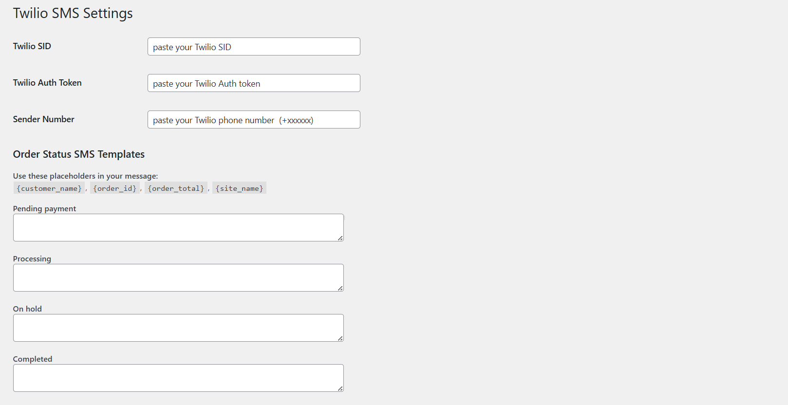

# 📲 Twilio SMS Notifications for WooCommerce

Easily notify your customers via SMS when their WooCommerce order status changes using Twilio.  
Perfect for stores that want to improve communication and boost trust.

---

## ✨ Features

- Send SMS notifications on any WooCommerce order status (Processing, Completed, etc.)
- Customize message templates with dynamic placeholders
- Easy setup via WordPress Admin panel
- No coding required

---

## 🚀 How to Get Started

1. **Install and Activate the Plugin**
2. Go to:  
   `WordPress Admin → Twilio SMS`

3. Enter your:
   - **Twilio Account SID**
   - **Twilio Auth Token**
   - **Twilio Sender Number (Purchased number)**

> 📷 **Below is Screenshot 1** showing the Twilio SMS setup interface:

---

## 📝 Creating Message Templates with Placeholders

You can write custom SMS messages for any WooCommerce order status using these placeholders:

| Placeholder        | Replaced With                   |
|--------------------|---------------------------------|
| `{customer_name}`  | Billing First Name              |
| `{order_id}`       | WooCommerce Order ID            |
| `{order_total}`    | Total amount of the order       |
| `{site_name}`      | Your WordPress site title       |

---

### 🧾 Example:

For the **Processing** status, you can enter:
Hi {customer_name}, your order #{order_id} of ${order_total} has been received at {site_name}. Thank you!

> 📷 **Below is Screenshot 2** showing how to add message templates:

---

## 🧠 Requirements

- WooCommerce Installed and Active
- Twilio Account (Free or Paid)

---

## 🔐 Security & Notes

- Make sure you **verify phone numbers** if you're using a Twilio trial account.
- Always test with your own number first.

---

## 📦 License

This plugin is free and open-source. You are welcome to modify and redistribute it under GPLv2 or later.

---

## 🙌 Contributions

Feel free to fork and contribute via GitHub:  
[github.com/your-repo-link](https://github.com/Abdullahhh12/twilio-sms-notifications-woocommerce)

---

